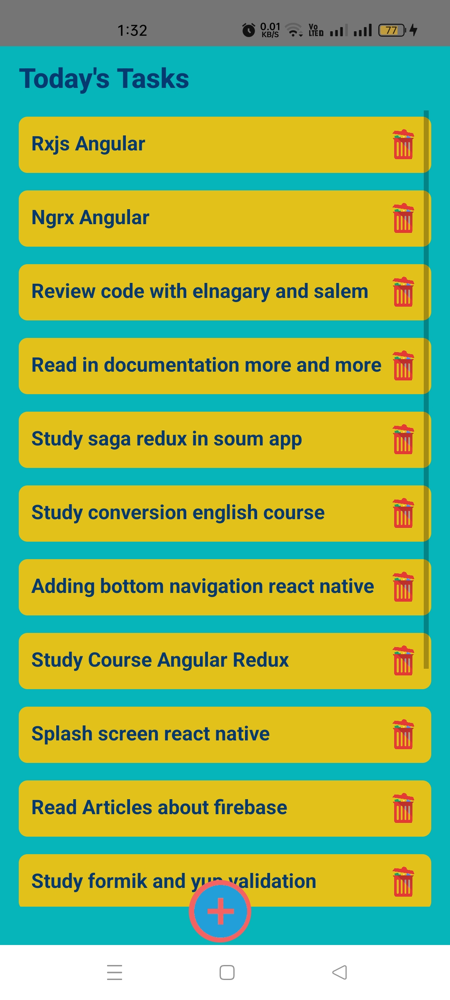
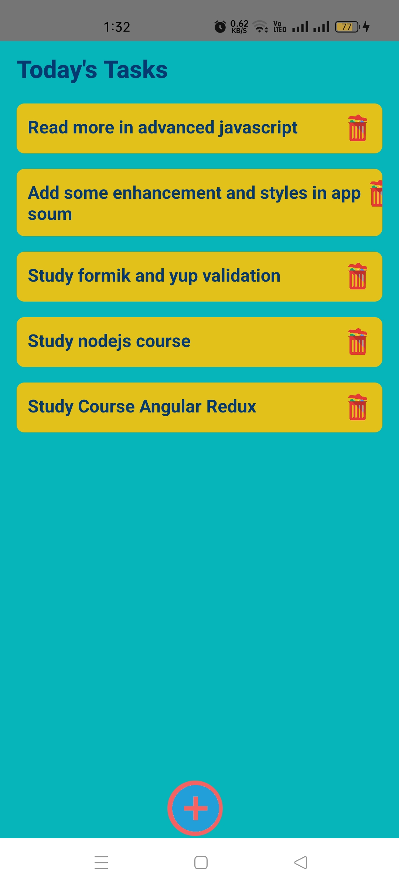
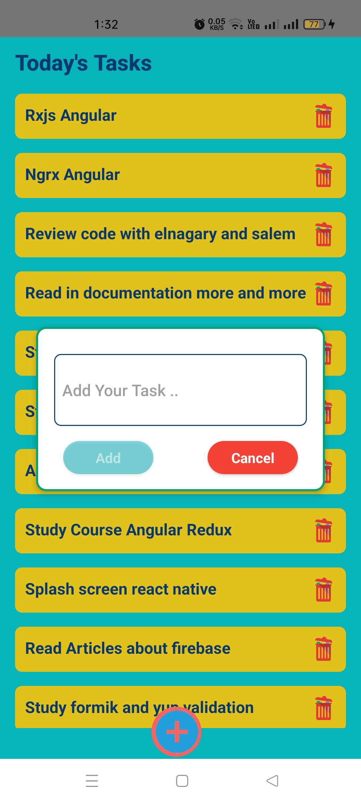
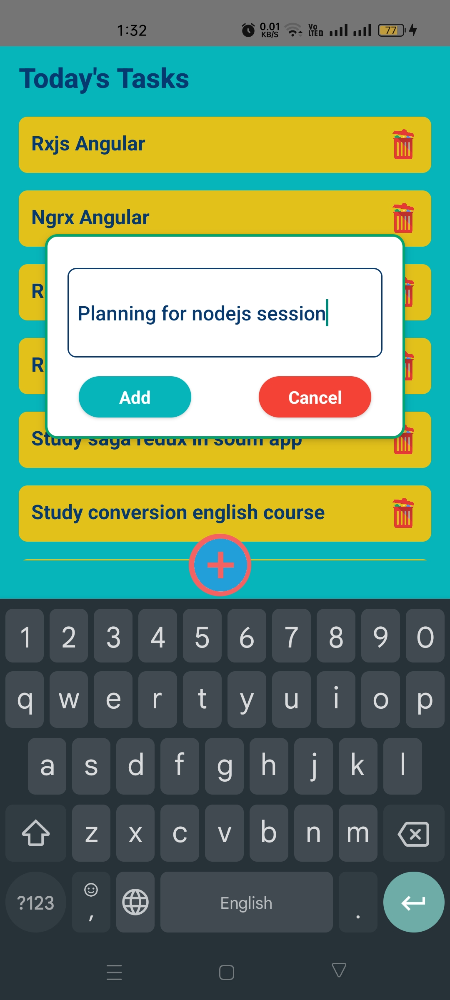
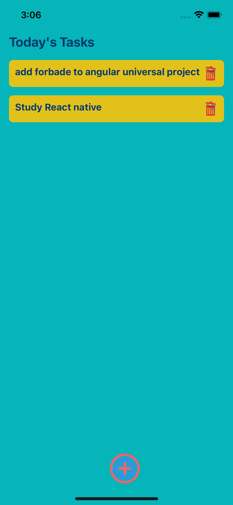
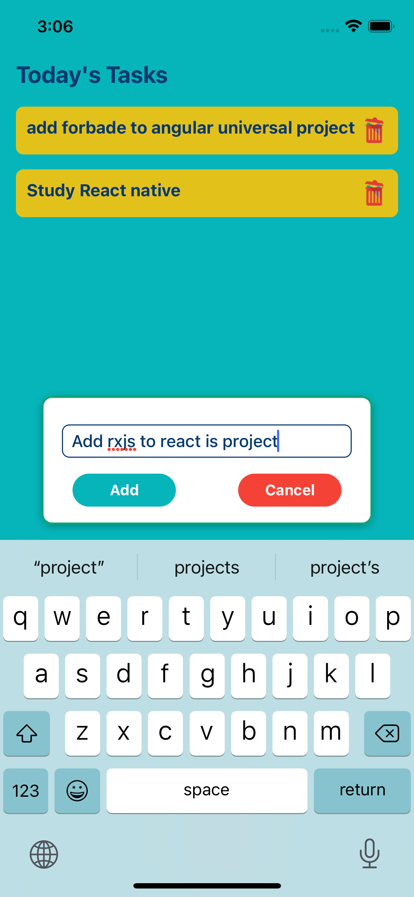
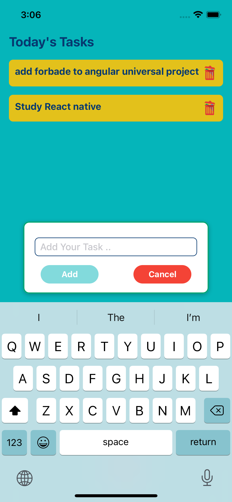

# Mobile-ToDo-React-Native-app-

## Description

This is React native To-App.

It is a mobile application that allows users to Add Tasks and Delete it when finished or done.

The app is built with React Native and was developed and tested for **IOS && Android**.

### Running the application

This application is build using [React Native CLI].

`$ yarn install`

`$ npm run android && npm run ios`

### ScreenShot

  
  
  
  
  
  
  
  
  

